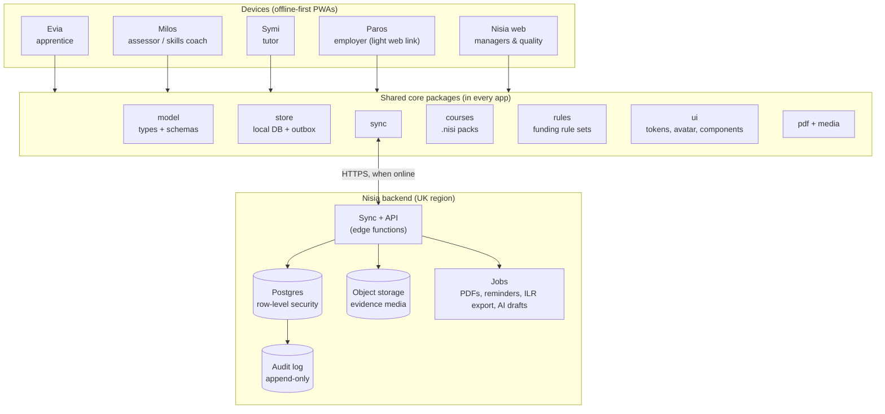
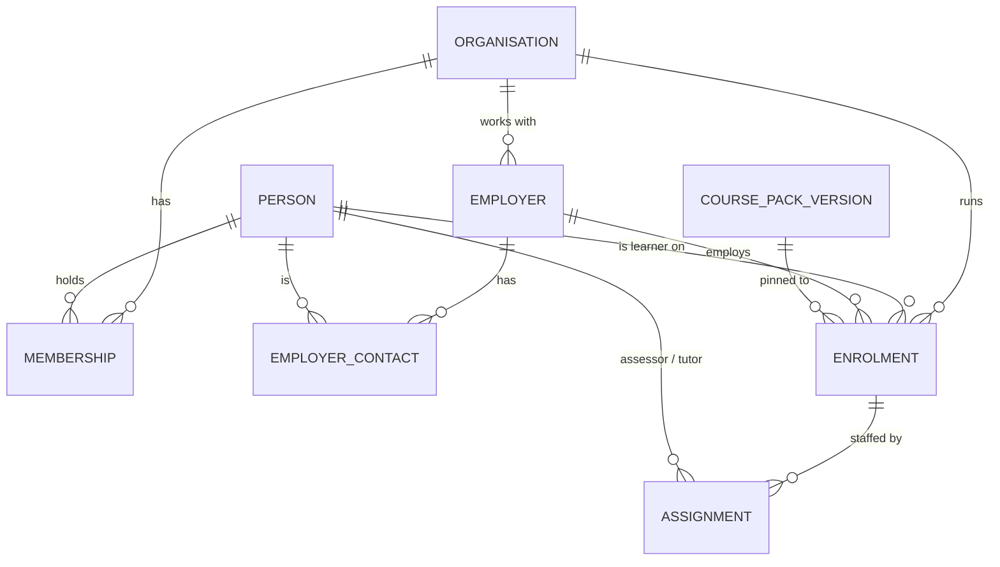
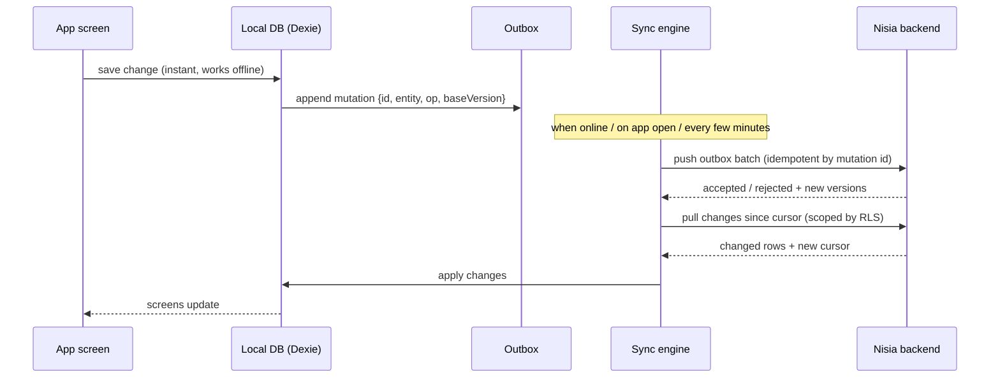
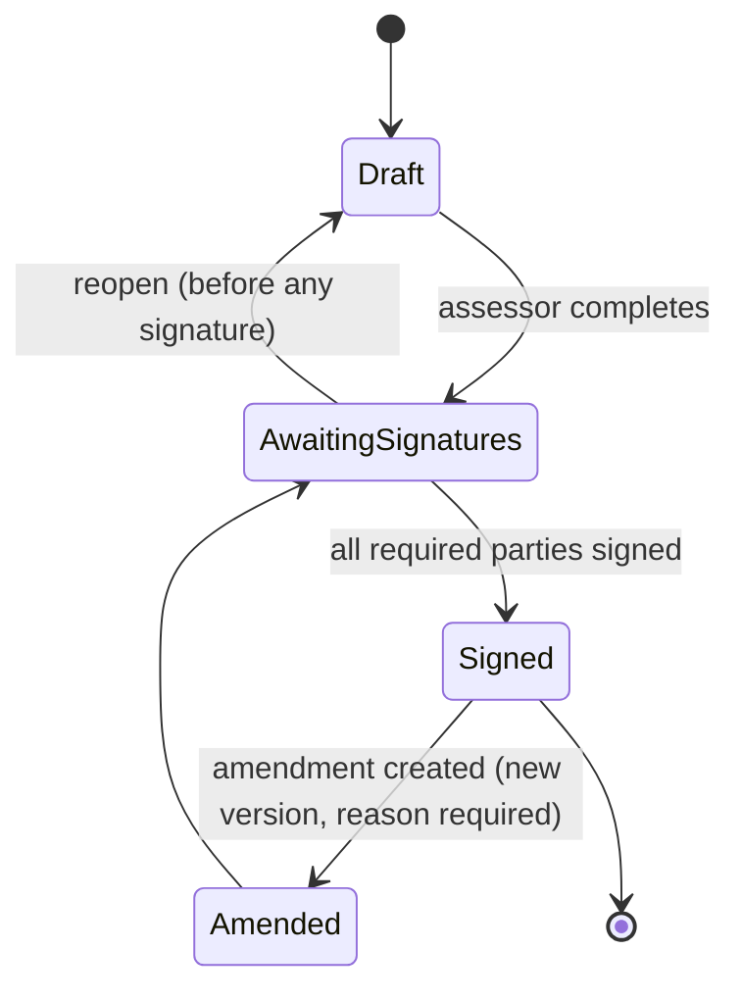

# Nisia shared core — architecture draft

Status: **Draft v0.1** · for discussion · September 2026

This describes the shared foundation that Evia (apprentice), Milos (assessor), Symi (tutor), Paros (employer) and the Nisia platform are built on. It replaces the current model of separate apps that talk only through QR codes and keep all data on one device.

---

## 1. Goals and principles

1. **One source of truth.** Every record — an enrolment, a piece of evidence, a review, an OTJ entry — exists once, on the Nisia backend. The apps are views onto it for different roles.
2. **Offline-first stays.** Assessors and apprentices work on sites with no signal. Every app keeps working offline and syncs when it can. Offline is a normal state, not an error.
3. **Build once, brand five times.** Data model, sync, course packs, design system, avatar, PDF and media handling live in shared packages. Each island is a thin, role-specific front end.
4. **Records you can defend at audit.** Signed reviews and observations are immutable, versioned and hashed. Every change is attributable to a person and a time.
5. **Privacy by design.** UK data residency, least-privilege access per role, special-category data (wellbeing, support needs) held separately with tighter access, no third-party calls with personal data without consent.
6. **Rules are data, not code.** Funding-rule details (review intervals, OTJ minimums, what a review must contain) change most years. They live in versioned rule sets, not scattered through app logic.

---

## 2. Big picture



Every app is built from the same packages; only the screens and the role differ. Paros and the Nisia web dashboard are online-first (office and employer use) but are built from the same packages.

---

## 3. Key decisions

| # | Decision | Recommendation | Why | Alternatives considered |
|---|---|---|---|---|
| D1 | Repository layout | **One monorepo** (`nisia/`) with `packages/*` and `apps/*`, using pnpm workspaces | Shared code changes once and every app picks it up; one CI; no copy-paste parity work (the current Milos↔Evia avatar commits are the symptom) | Separate repos per app (current state) |
| D2 | Language and build | **TypeScript + Vite** | Types catch the data-shape bugs the current patch layers work around; Vite gives hashed filenames, which removes all manual `?v=` cache-busting | Plain JS (current), Next.js (too server-centric for offline PWAs) |
| D3 | UI framework | **Preact** (≈4 KB) with shared components | Small, fast on cheap phones, familiar React model, easy to hire for | React (heavier), Svelte, Lit web components |
| D4 | Service worker | **vite-plugin-pwa (Workbox)**, generated from the build | Replaces the hand-maintained `sw.js` asset list and `update.json` version juggling | Hand-written worker (current) |
| D5 | Backend | **Supabase, London region** (Postgres, Auth, Storage, Edge Functions) | Postgres row-level security fits multi-tenant colleges; auth, storage and resumable uploads included; can be self-hosted later if a college demands it | Firebase (non-relational, weaker fit for reporting/ILR), custom Node + Postgres (more to run) |
| D6 | Local database | **IndexedDB via Dexie** | Mature, handles large blobs (video evidence), works on iOS Safari | localStorage (current; 5 MB limit, easily evicted), SQLite-WASM |
| D7 | Sync | **Outbox + pull-by-cursor, built in `packages/sync`** | Most records have a single author at a time, so conflicts are rare and simple rules suffice (§7). Keeps us vendor-independent | PowerSync or ElectricSQL (less code, but another vendor and cost; revisit if sync becomes a burden) |
| D8 | IDs | **UUIDv7, generated on the device** | Records can be created offline and still be globally unique; time-ordered for easy sorting | Server-assigned IDs (breaks offline creation) |
| D9 | Validation | **Zod schemas** in `packages/model`, used on device *and* in edge functions | One definition of "a valid review" everywhere | Separate client/server validation |

---

## 4. Monorepo layout

```
nisia/
├─ apps/
│  ├─ evia/          apprentice PWA
│  ├─ milos/         assessor PWA
│  ├─ symi/          tutor PWA
│  ├─ paros/         employer web (link-based, sign & view)
│  └─ nisia-web/     platform dashboard for managers / quality / admin
├─ packages/
│  ├─ model/         entity types, Zod schemas, state machines
│  ├─ store/         Dexie database, repositories, outbox
│  ├─ sync/          push/pull engine, conflict rules, media upload queue
│  ├─ auth/          sign-in, device pairing, role/permission helpers
│  ├─ courses/       .nisi course-pack schema, loader, version migrations
│  ├─ rules/         funding rule sets (review interval, OTJ minimum, review sections)
│  ├─ ui/            design tokens (one palette per island), avatar, components
│  ├─ pdf/           review / observation / mileage PDF templates
│  ├─ media/         capture, compression, MP4 faststart, WebM duration fix
│  ├─ qr/            QR contract v1 (legacy) + v2 pairing codes
│  └─ ai/            (later) draft generation client, provenance tagging
├─ services/
│  ├─ supabase/      SQL migrations, RLS policies, seed data
│  └─ functions/     edge functions: sync, sign, pdf, export, ai-draft
├─ course-packs/     source .nisi packs (moved from Milos)
└─ tools/            migration scripts (Milos v2 → core, Evia → core)
```

Each island gets its own colour through `packages/ui` tokens (Milos blue `#2C85F7`, Evia's colour, and so on) and the same avatar component, so "avatar parity" is one component, not a copy.

---

## 5. Data model

### 5.1 Tenancy and people



- **Organisation** — a college or training provider (the tenant). Optional `department` for multi-department colleges.
- **Person** — any human. Roles come from **Membership** (`admin`, `quality`, `manager`, `assessor`, `tutor`, `learner`) and **EmployerContact** (`line_manager`, `mentor`).
- **Enrolment** — one learner on one apprenticeship: course pack version, start date, planned end, practical period end, employer, status (`active`, `break_in_learning`, `gateway`, `epa`, `completed`, `withdrawn`), funding rule set.
- **Assignment** — which staff work with which enrolment, and in what role. This drives access (§6).

### 5.2 Learning and evidence

| Entity | Written by | Key fields | Notes |
|---|---|---|---|
| **CriterionStatus** | derived | enrolment, code, `claimed` / `observed` / `verified`, sources | Replaces the QR "completed codes" + "blue o". Computed from evidence and judgements, never typed in by hand |
| **Evidence** | Evia (learner), Milos (assessor), Symi (tutor) | enrolment, type (photo/video/audio/written/witness/observation/professional discussion), claimed criteria, captured at, location (optional), media refs | Append-only once submitted |
| **MediaAsset** | any | storage key, MIME type, size, SHA-256, duration, upload state | Uploaded resumably; the hash proves the file is unchanged |
| **EvidenceJudgement** | Milos | evidence, assessor, decision (`accepted` / `referred` / `rejected`), criteria confirmed, feedback | The loop Evia and Milos currently cannot do: judge evidence and send feedback back |
| **Observation** | Milos | enrolment, date, sections observed (category → job → opportunity), criteria judged, narrative sections, media, signatures, state | Current Milos observation, moved to the backend |
| **ProgressReview** | Milos (+ learner, employer) | enrolment, period, sections (per rule set), agreed actions, overall status, signatures, state, version | Current Milos review; state machine in §8 |
| **Action** (target) | any participant | owner, title, due date, linked criterion, status | Replaces QR `tg` targets; shared by Evia, Milos, Paros |
| **LearningHoursEntry** (OTJ/GLH) | Evia, Symi | enrolment, date, minutes, activity type, description, verified by | Rolled up for OTJ tracking |
| **Session** + **Attendance** | Symi | group or individual session, register | Tutor-delivered off-the-job training |
| **Visit** | Milos | enrolment, planned/actual time, site address, purpose, travel | Current calendar, travel and mileage features |
| **WellbeingCheck** / **SupportNeed** | Milos, Evia | enrolment, response, note, follow-up | **Special category.** Separate table, narrower access (§6) |
| **AuditEvent** | backend only | actor, action, entity, before/after hash, time, device | Append-only, written by database triggers |

### 5.3 Where current Milos data goes

| Milos v2.80 storage | New home |
|---|---|
| `milos-settings-v1` | `Person` (assessor details) + device settings in the local DB |
| `milos-learner-profiles-v1` | `Person` (learner) + `Enrolment` + `Assignment` |
| profile `snapshots[]` (from Evia QR) | No longer needed: `CriterionStatus`, `LearningHoursEntry` and `Action` are live. Kept read-only as history |
| `milos-reviews-v1` | `ProgressReview` + `Signature` + `Action` |
| `milos-observations-v1` | `Observation` + `EvidenceJudgement` |
| IndexedDB `milos-assessor-media-v1` | `MediaAsset` (uploaded) + local blob cache |
| `sharedId` | Legacy link used once to match a Milos profile with an Evia learner during migration |

---

## 6. Identity, roles and access

### 6.1 Sign-in

| Who | How |
|---|---|
| College staff | Email magic link at first; **Microsoft Entra ID single sign-on** in Nisia Pro (most colleges use Microsoft 365) |
| Apprentices | Invite link or **pairing QR** shown by their assessor (§10) → magic link to email; the device then stays signed in |
| Employers | **Signed, time-limited links** per task (for example, "sign this review"). Optional account for employers with several apprentices |

Devices hold a refresh token. Offline use continues with the last valid session; sync resumes when the token can be refreshed.

### 6.2 Who can see what

Enforced by Postgres row-level security, so an app bug cannot leak another college's or another learner's data.

| Data | Learner | Assessor | Tutor | Employer | Manager / quality |
|---|---|---|---|---|---|
| Own enrolment, progress, actions | ✅ read | ✅ assigned | ✅ assigned | ✅ own apprentices | ✅ org |
| Evidence | ✅ own, write | ✅ assigned, judge | ✅ assigned, read | 👁 summary only | ✅ org, read |
| Reviews | ✅ read + sign | ✅ write + sign | 👁 read | ✅ read + sign | ✅ read |
| Observations | ✅ read | ✅ write | 👁 read | 👁 summary | ✅ read |
| OTJ entries | ✅ write | ✅ verify | ✅ write + verify | 👁 totals | ✅ read |
| Wellbeing / support needs | ✅ own | ✅ assigned | ❌ unless shared | ❌ | Safeguarding lead only |
| Audit log | ❌ | ❌ | ❌ | ❌ | ✅ quality/admin |

---

## 7. Offline and sync

### 7.1 How it works



- **Push** is idempotent: re-sending a mutation with the same ID is harmless, so flaky signal cannot duplicate records.
- **Pull** only returns what the user may see (RLS), so an assessor's phone holds their caseload, not the whole college.
- **Media** uploads separately in a resumable queue (Supabase Storage supports the TUS protocol). A 200 MB site video can upload over several sessions. Records reference media by ID and show "uploading" until done.
- The app calls `navigator.storage.persist()` and shows an **unsynced changes** badge, so nobody leaves a site thinking a review is saved centrally when it isn't.

### 7.2 Conflict rules

Most records have one author at a time, so the rules stay simple:

| Kind of record | Rule |
|---|---|
| Append-only (evidence, OTJ entries, signatures, judgements, audit) | No conflicts possible; everything is kept |
| Drafts with one owner (a review or observation being written) | Field-level last-writer-wins, using a per-field timestamp |
| Shared lists (actions) | Field-level merge; completing an action wins over editing it |
| **Signed records** | Immutable. A change after signing creates a new **amendment version** (§8), never an overwrite |
| Rejected mutation (for example, the enrolment was withdrawn meanwhile) | Kept locally, flagged to the user with the reason; never silently dropped |

---

## 8. Record integrity

Progress reviews and observations follow a state machine defined in `packages/model`:



- On completion, the record content is serialised canonically and **hashed (SHA-256)**. Each signature stores that hash, so a signature is bound to exactly the text that was signed.
- The PDF shows the hash and version in its footer; quality staff can check any printed copy against the system.
- Every state change writes an `AuditEvent`.
- **Text provenance:** each narrative section records whether it was `human`, `ai_draft` or `ai_draft_edited`. Sections that must be in the learner's or employer's own voice (apprentice comments, wellbeing, employer comments) only accept `human`. This replaces Milos's hidden 7-tap auto-fill with something that holds up at audit.

---

## 9. Course packs and rule sets

### 9.1 Course packs

The existing `.nisi` format (`nisiCoursePack: 1`, codes, code descriptions, OTJ minimum, EPA settings) is already a good base. It moves into `packages/courses` with:

- A **Zod schema** and a validator in CI, so a broken pack cannot ship.
- **Pinned versions:** an enrolment points to one exact pack version (for example `ST0095 v1.2`). A new version of a standard never changes an existing learner's criteria.
- **Migrations** between versions where a learner transfers to a new standard version, with the code mapping recorded.
- A **registry** served by Nisia (replacing `/Evia/course-delivery/registry-v1.json`), with organisation-private packs for colleges' own programmes.

### 9.2 Funding rule sets

`packages/rules` holds versioned rule sets, chosen per enrolment by start date:

```ts
// Illustrative
export const rules_2025_26: RuleSet = {
  id: "apprenticeship-funding-2025-26",
  appliesToStartsFrom: "2025-08-01",
  reviewIntervalWeeks: 12,
  reviewSections: ["previousActions", "trainingProgress", "otjProgress", /* ... */],
  requiredSignatories: ["provider", "apprentice", "employer"],
  otjMinimum: (pack, plannedHours) => /* ... */ 0,
};
```

The review form, the "review due" reminders, the dashboard's RAG status and the PDF layout all read the rule set. Next year's rule changes are a new file, not a code hunt.

---

## 10. Where QR codes still fit

QR stays, but as a handshake rather than a data pipe:

| Use | Payload |
|---|---|
| **Pairing** an apprentice's Evia to their enrolment | One-time code (`NISI:PAIR:2:<token>`) that expires after 15 minutes |
| **Offline handover** on site with no signal on either phone | Signed, compact progress or observation summary (v1 contract kept for compatibility), reconciled with the server later |
| **Employer sign link** | URL to the Paros signing page |

The v1 `NISI:EVIA:PROGRESS:1` and `NISI:MILOS:OBS:1` formats keep working during migration and are retired once every user is on synced versions.

---

## 11. Privacy, security and compliance

- **UK data residency:** Supabase London region for database, storage and functions. Documented in the data processing agreement.
- **Encryption:** TLS in transit; encrypted at rest (platform default). Local device data sits inside the browser's origin storage; the app signs out and clears it on request or when an admin removes a device.
- **Special-category data** (wellbeing, support needs, learning difficulties) lives in separate tables with narrower RLS and its own retention period.
- **Retention:** per-organisation settings (for example, six years after completion for funding audit), with scheduled deletion jobs.
- **Third parties:** no personal data leaves Nisia without consent. Address lookup and distances move from public OpenStreetMap servers to a **self-hosted postcode dataset** (ONS Postcode Directory or a self-hosted postcodes.io).
- **Accessibility:** WCAG 2.2 AA across all apps. `packages/ui` components are built and tested for it once (automated axe checks in CI).
- **Procurement pack** (built alongside, not after): DPIA template, DPA, Cyber Essentials Plus, penetration test report, accessibility statement, data flow diagram (this document's §2 is a start).

---

## 12. Integrations (Nisia Pro, later)

| Integration | First version | Later |
|---|---|---|
| ILR / MIS (ebs, Unit-e, ProSolution) | CSV import of learners and enrolments; CSV export of OTJ, reviews, withdrawals | Direct connectors per MIS |
| Microsoft Entra ID | SSO for staff | Group-based role mapping |
| EPA organisations | Portfolio export (ZIP + index PDF + criteria map) | Direct submission where the EPAO has an API |
| AI drafting | Server-side edge function; drafts only, with provenance tagging (§8) | Evidence-to-criteria suggestions, voice notes to observation narrative |

---

## 13. Migration plan

Each phase ends with something shippable, so progress is never blocked by the next phase.

| Phase | Work | Done when |
|---|---|---|
| **0 — Foundations** | Create the monorepo. Port `milos-core.js`, course packs, QR contract, PDF and media code into typed packages. Port the 201 existing Milos tests. Freeze new features on Milos v2.80 (bug fixes only) | Core packages pass the ported tests |
| **1 — Milos on core, still local-only** | Rebuild the Milos screens on `packages/ui` + `packages/store`. One-time importer from `milos-*` localStorage and `milos-assessor-media-v1`. Add backup/restore to a file | An assessor upgrades from v2.80 with no data loss and the same features; no patch layers |
| **2 — Backend and sync** | Supabase schema, RLS, sync engine, media upload queue, audit log, signed-record hashing. Nisia web dashboard MVP: caseload, reviews due, OTJ, evidence gaps | Two assessors and a manager share one organisation's data across devices, offline and online |
| **3 — Evia on core** | Evia rebuilt on the same packages; pairing replaces the progress QR; evidence flows to Milos for judgement and back | Evidence submitted in Evia is judged in Milos and the feedback appears in Evia |
| **4 — Paros** | Employer signing and progress web view | A three-way review is signed by all three parties on their own devices |
| **5 — Symi** | Sessions, registers, OTJ delivery, shaped by the pilot college's tutors | Pilot tutors use it for a full term |
| **6 — Pro** | Entra SSO, ILR/MIS CSV, EPAO export, AI drafting, analytics | First Pro contract |

Phases 0–2 are the critical path. Phases 4 and 5 can run in parallel once phase 3 has proved the pattern.

---

## 14. Open questions

1. **Where does Evia's code live?** It appears to be served from the same origin (`/Evia/`). Moving it into the monorepo in phase 0 is simplest.
2. **Evia without a college:** should apprentices or employers be able to use Evia on their own (a direct sign-up tier)? This changes tenancy: a "personal" organisation per user.
3. **Pilot college:** which MIS do they use, do they run Microsoft 365, and which department would pilot? This decides the first integration to build.
4. **Hosting budget and self-hosting:** will any target college insist on self-hosting or a named cloud? Supabase can be self-hosted, but that is a support commitment.
5. **Symi vs Milos boundary:** at the pilot college, are tutor and assessor different people? If not, Symi might be a mode of Milos first.
