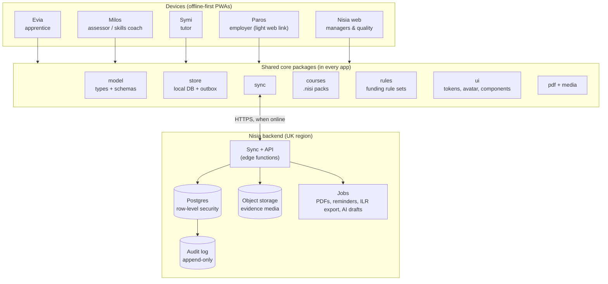
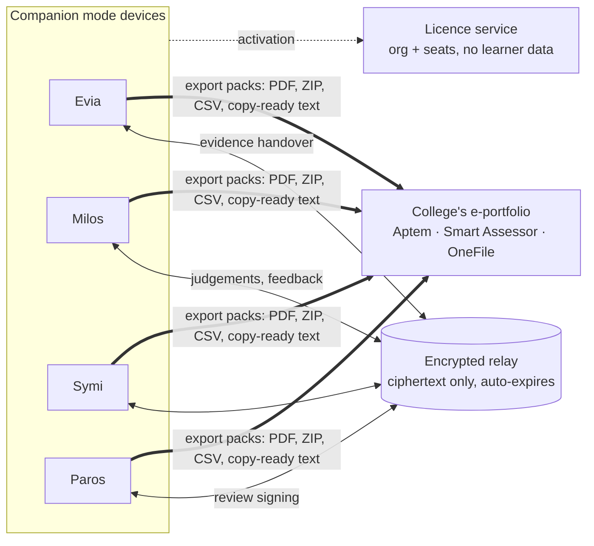
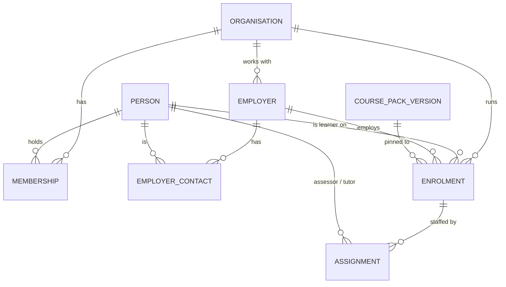
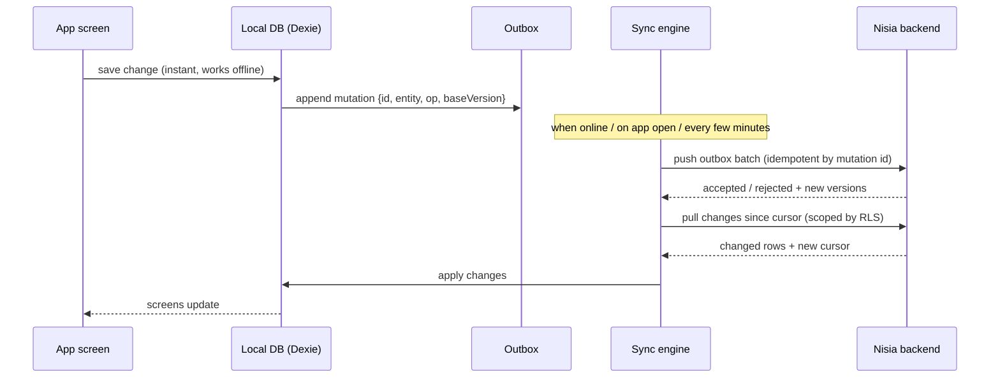
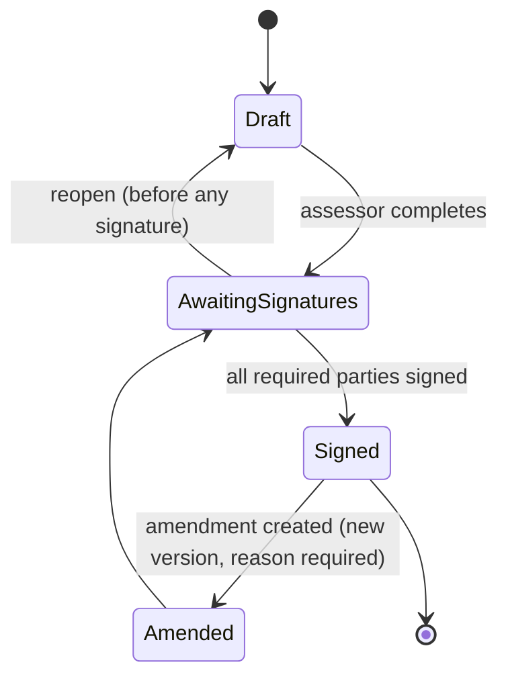

# Nisia shared core — architecture draft

Status: **Draft v0.2** · for discussion · September 2026

This describes the shared foundation that Evia (apprentice), Milos (assessor), Symi (tutor), Paros (employer) and the Nisia platform are built on.

**v0.2 change:** the go-to-market is now *companion first*. Evia, Milos, Symi and Paros are sold to work **alongside** a college's existing e-portfolio (Aptem, Smart Assessor, OneFile and so on) with **no migration**. Full migration onto Nisia happens only at **Nisia Pro**. The architecture now has two operating modes over the same core (§0).

---

## 0. Product stages and operating modes

| Tier | What the college gets | Operating mode | System of record |
|---|---|---|---|
| **Nisia Basic** | Evia for apprentices | **Companion** | The college's existing e-portfolio (Aptem, Smart Assessor…) |
| **Nisia+** | Evia + Milos + Symi + Paros | **Companion** | The college's existing e-portfolio |
| **Nisia Pro** | Everything, plus the Nisia platform | **Platform** | Nisia |

**Companion mode** is the way in: nothing to migrate, no MIS integration, no change to the college's audit trail. The apps make learners, assessors, tutors and employers better at their jobs (more and better evidence, faster reviews, fewer missed deadlines) and **hand finished work over** to the incumbent system in the format it accepts (§7A). The sales pitch is improved achievement rates and evidence quality, not replacing Aptem.

**Platform mode** is the destination: the same apps, now syncing to a Nisia backend that becomes the system of record, with the dashboard, audit log and integrations drafted in the rest of this document.

The crucial design rule: **one data model and one codebase for both modes.** Records created in companion mode have exactly the shape Nisia Pro expects, so upgrading a college to Pro is "switch on sync and upload", not a data conversion project. The only difference between the modes is which *sync adapter* the local store uses (§7):

| Adapter | Mode | What leaves the device |
|---|---|---|
| `none` | Companion | Nothing (exports and QR only) |
| `relay` | Companion | End-to-end encrypted handovers and backups; the server cannot read them (§7B) |
| `nisia` | Platform | Full sync to the Nisia backend (§7.1) |

---

## 1. Goals and principles

1. **One source of truth.** In platform mode every record — an enrolment, a piece of evidence, a review, an OTJ entry — exists once, on the Nisia backend. In companion mode the college's existing e-portfolio is the source of truth and the apps never compete with it.
2. **Offline-first stays.** Assessors and apprentices work on sites with no signal. Every app keeps working offline and syncs when it can. Offline is a normal state, not an error.
3. **Build once, brand five times.** Data model, sync, course packs, design system, avatar, PDF and media handling live in shared packages. Each island is a thin, role-specific front end.
4. **Records you can defend at audit.** Signed reviews and observations are immutable, versioned and hashed. Every change is attributable to a person and a time.
5. **Privacy by design.** UK data residency, least-privilege access per role, special-category data (wellbeing, support needs) held separately with tighter access, no third-party calls with personal data without consent.
6. **Rules are data, not code.** Funding-rule details (review intervals, OTJ minimums, what a review must contain) change most years. They live in versioned rule sets, not scattered through app logic.

---

## 2. Big picture



Every app is built from the same packages; only the screens and the role differ. Paros and the Nisia web dashboard are online-first (office and employer use) but are built from the same packages.

The diagram shows **platform mode** (Nisia Pro). In **companion mode** the backend shrinks to two small services that hold no readable learner data: a **licence service** (organisations, activation codes, seat counts) and an **encrypted relay** (§7B). Finished work leaves the apps as export packs for the college's existing e-portfolio (§7A).



---

## 3. Key decisions

| # | Decision | Recommendation | Why | Alternatives considered |
|---|---|---|---|---|
| D1 | Repository layout | **One monorepo** (`nisia/`) with `packages/*` and `apps/*`, using pnpm workspaces | Shared code changes once and every app picks it up; one CI; no copy-paste parity work (the current Milos↔Evia avatar commits are the symptom) | Separate repos per app (current state) |
| D2 | Language and build | **TypeScript + Vite** | Types catch the data-shape bugs the current patch layers work around; Vite gives hashed filenames, which removes all manual `?v=` cache-busting | Plain JS (current), Next.js (too server-centric for offline PWAs) |
| D3 | UI framework | **Preact** (≈4 KB) with shared components | Small, fast on cheap phones, familiar React model, easy to hire for | React (heavier), Svelte, Lit web components |
| D4 | Service worker | **vite-plugin-pwa (Workbox)**, generated from the build | Replaces the hand-maintained `sw.js` asset list and `update.json` version juggling | Hand-written worker (current) |
| D5 | Backend | **Supabase, London region** (Postgres, Auth, Storage, Edge Functions) | Postgres row-level security fits multi-tenant colleges; auth, storage and resumable uploads included; can be self-hosted later if a college demands it | Firebase (non-relational, weaker fit for reporting/ILR), custom Node + Postgres (more to run) |
| D6 | Local database | **IndexedDB via Dexie** | Mature, handles large blobs (video evidence), works on iOS Safari | localStorage (current; 5 MB limit, easily evicted), SQLite-WASM |
| D7 | Sync | **Outbox + pull-by-cursor, built in `packages/sync`** | Most records have a single author at a time, so conflicts are rare and simple rules suffice (§7). Keeps us vendor-independent | PowerSync or ElectricSQL (less code, but another vendor and cost; revisit if sync becomes a burden) |
| D8 | IDs | **UUIDv7, generated on the device** | Records can be created offline and still be globally unique; time-ordered for easy sorting | Server-assigned IDs (breaks offline creation) |
| D9 | Validation | **Zod schemas** in `packages/model`, used on device *and* in edge functions | One definition of "a valid review" everywhere | Separate client/server validation |
| D10 | Sync adapters | **Pluggable adapter in `packages/store`**: `none`, `relay`, `nisia` (§0) | Companion and platform modes share every line of app code; upgrading a college to Pro is a configuration change | Separate "lite" and "pro" builds (double the maintenance) |
| D11 | Portability | **Standard Postgres + SQL migrations; Supabase-specific features only behind `services/`** | Self-hosting requirements are unknown (§14). Keeping to plain Postgres, RLS and S3-compatible storage means Nisia can move to a college-mandated host later without a rewrite | Deep use of vendor-only features |
| D12 | End-to-end encryption for companion mode | **WebCrypto ECDH (P-256) key exchange at pairing + AES-GCM per payload** | Built into every browser, no extra library; the relay only ever sees ciphertext | A third-party E2EE SDK |

---

## 4. Monorepo layout

```
nisia/
├─ apps/
│  ├─ evia/          apprentice PWA
│  ├─ milos/         assessor PWA
│  ├─ symi/          tutor PWA
│  ├─ paros/         employer web (link-based, sign & view)
│  └─ nisia-web/     platform dashboard for managers / quality / admin
├─ packages/
│  ├─ model/         entity types, Zod schemas, state machines
│  ├─ store/         Dexie database, repositories, outbox
│  ├─ sync/          push/pull engine, conflict rules, media upload queue
│  ├─ auth/          sign-in, device pairing, role/permission helpers
│  ├─ courses/       .nisi course-pack schema, loader, version migrations
│  ├─ rules/         funding rule sets (review interval, OTJ minimum, review sections)
│  ├─ ui/            design tokens (one palette per island), avatar, components
│  ├─ pdf/           review / observation / mileage PDF templates
│  ├─ media/         capture, compression, MP4 faststart, WebM duration fix
│  ├─ qr/            QR contract v1 (legacy) + v2 pairing codes
│  ├─ export/        export profiles for Aptem, Smart Assessor, OneFile, generic (§7A)
│  ├─ crypto/        pairing keys, payload encryption, encrypted backups (§7B)
│  └─ ai/            (later) draft generation client, provenance tagging
├─ services/
│  ├─ supabase/      SQL migrations, RLS policies, seed data
│  ├─ functions/     edge functions: sync, sign, pdf, export, ai-draft
│  ├─ relay/         companion-mode encrypted relay (ciphertext only)
│  └─ licence/       organisations, activation codes, seats, anonymous metrics
├─ course-packs/     source .nisi packs (moved from Milos)
└─ tools/            migration scripts (Milos v2 → core, Evia → core)
```

Each island gets its own colour through `packages/ui` tokens (Milos blue `#2C85F7`, Evia's colour, and so on) and the same avatar component, so "avatar parity" is one component, not a copy.

---

## 5. Data model

### 5.1 Tenancy and people



- **Organisation** — a college or training provider (the tenant). Optional `department` for multi-department colleges.
- **Person** — any human. Roles come from **Membership** (`admin`, `quality`, `manager`, `assessor`, `tutor`, `learner`) and **EmployerContact** (`line_manager`, `mentor`).
- **Enrolment** — one learner on one apprenticeship: course pack version, start date, planned end, practical period end, employer, status (`active`, `break_in_learning`, `gateway`, `epa`, `completed`, `withdrawn`), funding rule set.
- **Assignment** — which staff work with which enrolment, and in what role. This drives access (§6).

### 5.2 Learning and evidence

| Entity | Written by | Key fields | Notes |
|---|---|---|---|
| **CriterionStatus** | derived | enrolment, code, `claimed` / `observed` / `verified`, sources | Replaces the QR "completed codes" + "blue o". Computed from evidence and judgements, never typed in by hand |
| **Evidence** | Evia (learner), Milos (assessor), Symi (tutor) | enrolment, type (photo/video/audio/written/witness/observation/professional discussion), claimed criteria, captured at, location (optional), media refs | Append-only once submitted |
| **MediaAsset** | any | storage key, MIME type, size, SHA-256, duration, upload state | Uploaded resumably; the hash proves the file is unchanged |
| **EvidenceJudgement** | Milos | evidence, assessor, decision (`accepted` / `referred` / `rejected`), criteria confirmed, feedback | The loop Evia and Milos currently cannot do: judge evidence and send feedback back |
| **Observation** | Milos | enrolment, date, sections observed (category → job → opportunity), criteria judged, narrative sections, media, signatures, state | Current Milos observation, moved to the backend |
| **ProgressReview** | Milos (+ learner, employer) | enrolment, period, sections (per rule set), agreed actions, overall status, signatures, state, version | Current Milos review; state machine in §8 |
| **Action** (target) | any participant | owner, title, due date, linked criterion, status | Replaces QR `tg` targets; shared by Evia, Milos, Paros |
| **LearningHoursEntry** (OTJ/GLH) | Evia, Symi | enrolment, date, minutes, activity type, description, verified by | Rolled up for OTJ tracking |
| **Session** + **Attendance** | Symi | group or individual session, register | Tutor-delivered off-the-job training |
| **Visit** | Milos | enrolment, planned/actual time, site address, purpose, travel | Current calendar, travel and mileage features |
| **WellbeingCheck** / **SupportNeed** | Milos, Evia | enrolment, response, note, follow-up | **Special category.** Separate table, narrower access (§6) |
| **AuditEvent** | backend only | actor, action, entity, before/after hash, time, device | Append-only, written by database triggers |

### 5.3 Where current Milos data goes

| Milos v2.80 storage | New home |
|---|---|
| `milos-settings-v1` | `Person` (assessor details) + device settings in the local DB |
| `milos-learner-profiles-v1` | `Person` (learner) + `Enrolment` + `Assignment` |
| profile `snapshots[]` (from Evia QR) | No longer needed: `CriterionStatus`, `LearningHoursEntry` and `Action` are live. Kept read-only as history |
| `milos-reviews-v1` | `ProgressReview` + `Signature` + `Action` |
| `milos-observations-v1` | `Observation` + `EvidenceJudgement` |
| IndexedDB `milos-assessor-media-v1` | `MediaAsset` (uploaded) + local blob cache |
| `sharedId` | Legacy link used once to match a Milos profile with an Evia learner during migration |

---

## 6. Identity, roles and access

### 6.1 Sign-in

| Who | How |
|---|---|
| College staff | Email magic link at first; **Microsoft Entra ID single sign-on** in Nisia Pro (most colleges use Microsoft 365) |
| Apprentices | Invite link or **pairing QR** shown by their assessor (§10) → magic link to email; the device then stays signed in |
| Employers | **Signed, time-limited links** per task (for example, "sign this review"). Optional account for employers with several apprentices |

Devices hold a refresh token. Offline use continues with the last valid session; sync resumes when the token can be refreshed.

**Companion mode** has no personal accounts at all:

| Who | How |
|---|---|
| College | Buys a licence; receives an organisation activation code per app |
| Staff (Milos, Symi) | Enter the activation code once on their device; name and details stay on the device |
| Apprentices (Evia) | Activated by their assessor's **pairing QR**, which also sets up the encrypted channel between the two devices (§7B) |
| Employers (Paros) | Open a one-time link sent by the assessor; the link carries the decryption key in the URL fragment, which never reaches the server |

The access table below applies to platform mode. In companion mode access is simpler: each device only holds what its owner created or was sent through a pairing.

### 6.2 Who can see what

Enforced by Postgres row-level security, so an app bug cannot leak another college's or another learner's data.

| Data | Learner | Assessor | Tutor | Employer | Manager / quality |
|---|---|---|---|---|---|
| Own enrolment, progress, actions | ✅ read | ✅ assigned | ✅ assigned | ✅ own apprentices | ✅ org |
| Evidence | ✅ own, write | ✅ assigned, judge | ✅ assigned, read | 👁 summary only | ✅ org, read |
| Reviews | ✅ read + sign | ✅ write + sign | 👁 read | ✅ read + sign | ✅ read |
| Observations | ✅ read | ✅ write | 👁 read | 👁 summary | ✅ read |
| OTJ entries | ✅ write | ✅ verify | ✅ write + verify | 👁 totals | ✅ read |
| Wellbeing / support needs | ✅ own | ✅ assigned | ❌ unless shared | ❌ | Safeguarding lead only |
| Audit log | ❌ | ❌ | ❌ | ❌ | ✅ quality/admin |

---

## 7. Offline and sync

### 7.1 How it works



- **Push** is idempotent: re-sending a mutation with the same ID is harmless, so flaky signal cannot duplicate records.
- **Pull** only returns what the user may see (RLS), so an assessor's phone holds their caseload, not the whole college.
- **Media** uploads separately in a resumable queue (Supabase Storage supports the TUS protocol). A 200 MB site video can upload over several sessions. Records reference media by ID and show "uploading" until done.
- The app calls `navigator.storage.persist()` and shows an **unsynced changes** badge, so nobody leaves a site thinking a review is saved centrally when it isn't.

### 7.2 Conflict rules

Most records have one author at a time, so the rules stay simple:

| Kind of record | Rule |
|---|---|
| Append-only (evidence, OTJ entries, signatures, judgements, audit) | No conflicts possible; everything is kept |
| Drafts with one owner (a review or observation being written) | Field-level last-writer-wins, using a per-field timestamp |
| Shared lists (actions) | Field-level merge; completing an action wins over editing it |
| **Signed records** | Immutable. A change after signing creates a new **amendment version** (§8), never an overwrite |
| Rejected mutation (for example, the enrolment was withdrawn meanwhile) | Kept locally, flagged to the user with the reason; never silently dropped |

---

## 7A. Working alongside Aptem and Smart Assessor (companion mode)

In companion mode the college's e-portfolio stays the system of record, so every app ends its workflow with a **hand-off**. If using Nisia means typing things twice, staff will drop it within weeks. Removing double entry is the most important companion-mode feature.

### Export packs

Every finished item produces a pack ready to upload or paste into the incumbent system:

| App | Finished item | Export pack |
|---|---|---|
| **Evia** | Evidence item or batch | Media files named `learner-ref_date_criteria_type`, a one-page PDF cover sheet (description, reflection, date, location, KSB/AC claimed), ZIP for batches, copy-ready text for the e-portfolio's evidence description box |
| **Milos** | Progress review | PDF laid out to the college's review template; copy-ready text per section for systems with their own review form |
| **Milos** | Observation | Observation PDF + media ZIP + evidence player (already built in Milos v2.x), plus a criteria list in the order the target system displays them, so ticking them off takes seconds |
| **Symi** | Session / register | Register PDF, OTJ entries as CSV |
| **Paros** | Employer sign-off / comments | Signed PDF with the record hash (§8) |

### Export profiles

`packages/export` holds one **profile per target system**, which sets file naming, field order, PDF layout and CSV columns:

- `aptem` and `smart-assessor` from day one, because the pilot college (Walsall College) uses both.
- `onefile` and `generic` next.
- Profiles are data (like course packs), so a new college's variation is configuration, not code.

**To confirm with the pilot college:** what each system accepts for bulk upload (file types, size limits, naming), and whether either offers a partner API. Build for manual upload first and treat an API as a bonus; the product must not depend on another vendor's goodwill.

### Proving impact without holding data

The companion pitch is better achievement rates and evidence quality, so the pilot needs numbers. Each app can send **opt-in, anonymous, aggregate** usage metrics to the licence service (for example, evidence items per learner per month, share of reviews completed on time, time from observation to upload). No names, no content, no learner references. These figures become the Walsall case study that sells Nisia+.

---

## 7B. Encrypted relay (companion mode)

The relay lets companion-mode apps work together without Nisia holding readable learner data.

1. **Pairing.** The assessor's Milos shows a QR code; the apprentice's Evia scans it. The two devices exchange public keys (ECDH) and derive a shared key. The relay never sees it.
2. **Handover.** Evia encrypts an evidence item (AES-GCM) and uploads the ciphertext with the recipient's device ID. Milos downloads, decrypts, judges it and returns the judgement and feedback the same way.
3. **Expiry.** Items are deleted from the relay once acknowledged, or after 30 days at most.
4. **Backup.** Each device can store an encrypted backup on the relay, locked with a recovery key the user keeps (printed or saved). This fixes today's biggest risk: a lost phone losing signed reviews.

**Honest limit:** the relay still processes some personal data (device IDs, IP addresses, timing, file sizes), so Nisia is still a data processor and a DPIA is still needed. It is a much smaller and easier DPIA than a platform holding readable evidence, which is itself a selling point for the companion tiers.

---

## 8. Record integrity

Progress reviews and observations follow a state machine defined in `packages/model`:



- On completion, the record content is serialised canonically and **hashed (SHA-256)**. Each signature stores that hash, so a signature is bound to exactly the text that was signed.
- The PDF shows the hash and version in its footer; quality staff can check any printed copy against the system.
- Every state change writes an `AuditEvent`.
- **Text provenance:** each narrative section records whether it was `human`, `ai_draft` or `ai_draft_edited`. Sections that must be in the learner's or employer's own voice (apprentice comments, wellbeing, employer comments) only accept `human`. This replaces Milos's hidden 7-tap auto-fill with something that holds up at audit.

---

## 9. Course packs and rule sets

### 9.1 Course packs

The existing `.nisi` format (`nisiCoursePack: 1`, codes, code descriptions, OTJ minimum, EPA settings) is already a good base. It moves into `packages/courses` with:

- A **Zod schema** and a validator in CI, so a broken pack cannot ship.
- **Pinned versions:** an enrolment points to one exact pack version (for example `ST0095 v1.2`). A new version of a standard never changes an existing learner's criteria.
- **Migrations** between versions where a learner transfers to a new standard version, with the code mapping recorded.
- A **registry** served by Nisia (replacing `/Evia/course-delivery/registry-v1.json`), with organisation-private packs for colleges' own programmes.

### 9.2 Funding rule sets

`packages/rules` holds versioned rule sets, chosen per enrolment by start date:

```ts
// Illustrative
export const rules_2025_26: RuleSet = {
  id: "apprenticeship-funding-2025-26",
  appliesToStartsFrom: "2025-08-01",
  reviewIntervalWeeks: 12,
  reviewSections: ["previousActions", "trainingProgress", "otjProgress", /* ... */],
  requiredSignatories: ["provider", "apprentice", "employer"],
  otjMinimum: (pack, plannedHours) => /* ... */ 0,
};
```

The review form, the "review due" reminders, the dashboard's RAG status and the PDF layout all read the rule set. Next year's rule changes are a new file, not a code hunt.

---

## 10. Where QR codes still fit

QR stays, but as a handshake rather than a data pipe:

| Use | Payload |
|---|---|
| **Pairing** an apprentice's Evia to their enrolment | One-time code (`NISI:PAIR:2:<token>`) that expires after 15 minutes |
| **Offline handover** on site with no signal on either phone | Signed, compact progress or observation summary (v1 contract kept for compatibility), reconciled with the server later |
| **Employer sign link** | URL to the Paros signing page |

The v1 `NISI:EVIA:PROGRESS:1` and `NISI:MILOS:OBS:1` formats keep working during migration and are retired once every user is on synced versions.

---

## 11. Privacy, security and compliance

- **UK data residency:** Supabase London region for database, storage and functions. Documented in the data processing agreement.
- **Encryption:** TLS in transit; encrypted at rest (platform default). Local device data sits inside the browser's origin storage; the app signs out and clears it on request or when an admin removes a device.
- **Special-category data** (wellbeing, support needs, learning difficulties) lives in separate tables with narrower RLS and its own retention period.
- **Retention:** per-organisation settings (for example, six years after completion for funding audit), with scheduled deletion jobs.
- **Third parties:** no personal data leaves Nisia without consent. Address lookup and distances move from public OpenStreetMap servers to a **self-hosted postcode dataset** (ONS Postcode Directory or a self-hosted postcodes.io).
- **Accessibility:** WCAG 2.2 AA across all apps. `packages/ui` components are built and tested for it once (automated axe checks in CI).
- **Procurement pack** (built alongside, not after): DPIA template, DPA, Cyber Essentials Plus, penetration test report, accessibility statement, data flow diagram (this document's §2 is a start).

---

## 12. Integrations (Nisia Pro, later)

| Integration | First version | Later |
|---|---|---|
| ILR / MIS (ebs, Unit-e, ProSolution) | CSV import of learners and enrolments; CSV export of OTJ, reviews, withdrawals | Direct connectors per MIS |
| Microsoft Entra ID | SSO for staff | Group-based role mapping |
| EPA organisations | Portfolio export (ZIP + index PDF + criteria map) | Direct submission where the EPAO has an API |
| AI drafting | Server-side edge function; drafts only, with provenance tagging (§8) | Evidence-to-criteria suggestions, voice notes to observation narrative |
| **Aptem / Smart Assessor import** | Import the college's learners, enrolments and evidence from each system's export files when moving to Pro | Scheduled import during a parallel-running period |
| **Companion device upload** | Each companion-mode device switches its sync adapter from `relay` to `nisia` and uploads its local records unchanged (D10) | — |

---

## 13. Delivery plan

Companion first, platform last. The backend comes late, which keeps early costs low and lets real use at the pilot college shape it. The data model is still designed for Pro from phase 0, so nothing built early has to be redone.

| Phase | Work | Sells as | Done when |
|---|---|---|---|
| **0 — Foundations** | Create the monorepo; bring in Evia and Milos from GitHub. Port `milos-core.js`, course packs, QR contract, PDF and media code into typed packages. Port the 201 existing Milos tests. Freeze new features on Milos v2.80 and current Evia (bug fixes only) | — | Core packages pass the ported tests |
| **1 — Companion core** | Rebuild Evia and Milos on the shared packages (`none` adapter). One-time importer from existing device storage. Backup/restore to a file. `aptem` and `smart-assessor` export profiles. Provenance tagging replaces the hidden auto-fill | **Nisia Basic** (Evia) pilot at Walsall College, one construction cohort | Pilot learners submit evidence through Evia and it reaches Aptem / Smart Assessor with no retyping |
| **2 — Relay and licensing** | Pairing, encrypted relay, Evia→Milos evidence handover with judgement and feedback back, encrypted device backup, licence service and activation codes, opt-in anonymous metrics | **Nisia+** pilot (Milos added) | An assessor judges Evia evidence in Milos, the feedback reaches the learner, and the finished pack is uploaded to the e-portfolio |
| **3 — Paros and Symi** | Paros as a link-based employer sign/view page over the relay. Symi for sessions, registers and OTJ delivery, shaped by Walsall's tutors | Full **Nisia+** | A three-way review is signed on three devices; pilot tutors use Symi for a full term |
| **4 — Platform** | Supabase schema, RLS, sync engine, media upload queue, audit log. Nisia web dashboard. Importers from companion devices and from Aptem / Smart Assessor exports | **Nisia Pro** (first migration) | One department runs on Nisia as its system of record, in parallel with the old system for one review cycle |
| **5 — Pro integrations** | Entra SSO, ILR/MIS CSV, EPAO export, AI drafting, analytics | Nisia Pro | First full Pro contract |

---

## 14. Decisions made and open questions

### Answered (September 2026)

| Question | Answer | Effect on this design |
|---|---|---|
| Where does Evia's code live? | GitHub | Brought into the monorepo in phase 0 |
| Who are the customers? | Colleges and apprenticeship providers | Tenancy is organisation-based; no direct-to-learner tier for now |
| Pilot college and incumbent systems | Walsall College, using Aptem and Smart Assessor | Both export profiles are needed in phase 1; the importers in phase 4 target both |
| Self-hosting | Unknown | D11: stay on portable Postgres and S3-style storage; ask Walsall's IT team during the pilot |
| Are tutors and assessors different people? | Yes | Symi stays a separate app, sharing everything but its screens |
| Migration strategy | None until Nisia Pro | Companion mode (§0, §7A, §7B) |

### Still open

1. **What Aptem and Smart Assessor accept:** bulk-upload formats, size limits and whether a partner API exists. Ask Walsall's e-portfolio administrators.
2. **Who owns the pilot at Walsall**, and which success measures they care about most (achievement rate, evidence per learner, reviews on time, learner confidence). This sets the anonymous metrics in §7A.
3. **Device policy:** do Walsall apprentices use their own phones, and do assessors have college-managed devices? This affects installation, storage limits and backup.
4. **Pricing** per tier (per learner per year is the market norm), and whether the pilot is free or discounted in exchange for a case study.
5. **Self-hosting:** confirm with Walsall's IT and data protection officer before phase 4.
